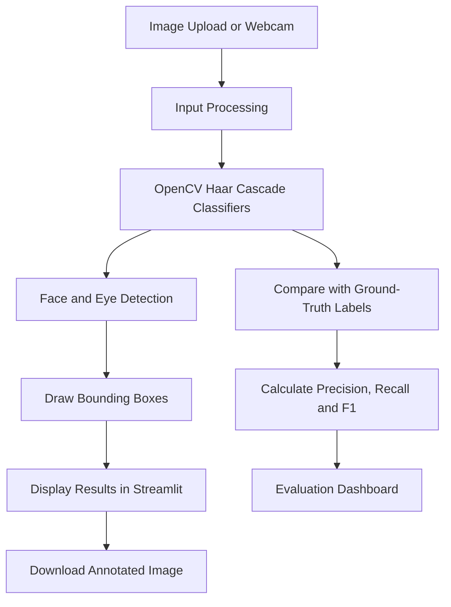

# 👁️ VisionLens — Computer Vision Studio

An interactive computer vision application built with **Python, OpenCV, and Streamlit** for face and eye detection in uploaded images and live webcam streams, with an integrated model evaluation dashboard.

## ✨ Features

- **Image Detection:** Upload images and detect faces and eyes using OpenCV Haar Cascade classifiers.
- **Real-Time Webcam Detection:** Process webcam frames and visualize detected faces and eyes.
- **Configurable Detection:** Adjust detection parameters, including scale factor, minimum neighbors, and minimum detection size.
- **Annotated Image Output:** View original and processed images side by side and download annotated results.
- **Performance Dashboard:** View detected face and eye counts, image dimensions, and processing time.
- **Model Evaluation:** Compare predicted detections with manually labeled ground-truth annotations.
- **Evaluation Metrics:** Calculate precision, recall, F1-score, true positives, false positives, and false negatives.
- **Per-Image Analysis:** Inspect detection performance for individual images through tables and visualizations.

## 🖥️ Application Preview

### 1. Image Detection

Upload an image to detect faces and eyes. View the original image, annotated output, and detection statistics.


### 2. Live Webcam

Run face and eye detection on live webcam frames.


### 3. Model Evaluation Dashboard

Analyze detection performance using evaluation metrics, per-image results, and a performance comparison chart.


## 🏗️ System Architecture



## 🛠️ Tech Stack

| Category | Technologies |
|---|---|
| Programming Language | Python |
| Computer Vision | OpenCV |
| Web Interface | Streamlit |
| Real-Time Video | Streamlit-WebRTC |
| Video Frame Handling | PyAV |
| Data Processing | NumPy, Pandas |
| Evaluation | Labeled images, bounding-box comparison, classification metrics |

## 🚀 Getting Started

### Prerequisites

- Python 3.10 or another version compatible with the dependencies
- pip
- A webcam for real-time detection

### 1. Clone the Repository

```bash
git clone https://github.com/dikshikka03/computer-vision-project.git
cd computer-vision-project
```

### 2. Create a Virtual Environment

**Windows PowerShell:**

```powershell
python -m venv .venv
.\.venv\Scripts\Activate.ps1
```

If PowerShell blocks environment activation, open a new terminal or use the appropriate activation command for your shell.

### 3. Install Dependencies

```bash
python -m pip install -r requirements.txt
```

### 4. Run the Streamlit Application

```bash
streamlit run app.py
```

Open the local URL shown in your terminal, usually:

http://localhost:8501

## 📊 Model Evaluation

VisionLens includes an evaluation module that compares detected faces with manually labeled ground-truth bounding boxes.

The evaluation dashboard reports:

- **Precision:** Proportion of predicted detections that are correct.
- **Recall:** Proportion of ground-truth faces successfully detected.
- **F1-score:** Harmonic mean of precision and recall.
- **True Positives (TP):** Correctly matched detections.
- **False Positives (FP):** Predicted detections without a valid ground-truth match.
- **False Negatives (FN):** Ground-truth faces that were missed.

### Current Evaluation Results

On the current labeled evaluation dataset, the dashboard reports:

| Metric | Result |
|---|---:|
| Precision | 0.467 |
| Recall | 0.583 |
| F1-score | 0.519 |
| True Positives | 7 |
| False Positives | 8 |
| False Negatives | 5 |

These results describe the current evaluation run and dataset. They should not be interpreted as a universal performance guarantee. Results can vary with image selection, annotation quality, detection parameters, and matching criteria.

## 📁 Project Structure

```text
computer-vision-project/
├── app.py
├── webcam.py
├── requirements.txt
├── README.md
├── .gitignore
├── .streamlit/
│   └── config.toml
├── evaluation/
│   ├── evaluate.py
│   ├── label_faces.py
│   ├── labels.json
│   └── images/
├── screenshots/
│   ├── image-detection.png
│   ├── live-webcam.png
│   └── model-evaluation.png
├── haarcascade_eye.xml
└── haarcascade_frontalface_default.xml
```

## ⚠️ Limitations

- Haar Cascade classifiers may be less reliable under challenging lighting, pose changes, occlusion, and low image quality.
- Real-time webcam functionality depends on camera permissions and the execution environment.
- Evaluation results depend on the labeled dataset and the evaluation methodology.
- Detection quality may require parameter tuning for different images.

## 🔮 Future Improvements

- Compare Haar Cascade classifiers with modern deep-learning-based object detectors.
- Expand the labeled evaluation dataset.
- Add more detailed error analysis and comparative evaluation.
- Improve robustness across different lighting conditions and face orientations.
- Explore additional object detection and segmentation capabilities.

## 👩‍💻 Author

**Dikshika**

- GitHub: [@dikshikka03](https://github.com/dikshikka03)
- Project Repository: [VisionLens — Computer Vision Studio](https://github.com/dikshikka03/computer-vision-project)

---

⭐ If you find this project useful, consider giving the repository a star.
